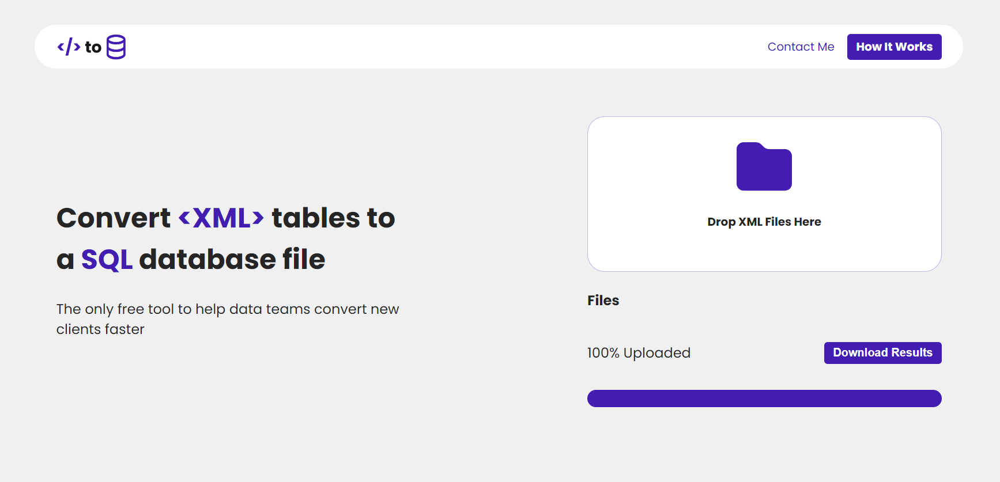

# XML to SQL Converter
## Summary
 This application provides a web interface that allows users to upload a folder of XML files and get the SQL commands required to write their XML to a database file. The intended use case for this application is to help data teams convert XML files from a previous DB export into a SQL database. 


[XMLtoSQL.com](https://www.xmltosql.com)

---
 ## Required Format
 ```xml
<Customers>
    <Customer>
        <Document>000 000 000</Document>
        <Name>Mary Angel</Name>
        <Address>Your City, YC 1212</Address>
        <Profession>Systems Analyst</Profession>
    </Customer>
    <Customer>
        <Document>000 000 001</Document>
        <Name>John Lenon</Name>
        <Address>Your City, YC 1212</Address>
        <Profession>Driver</Profession>
    </Customer>
</Customers>
 ```
This will output one table named Customers with 4 columns and 2 rows.

## Usage
Drag and drop files into the file upload section of the interface. The program will parse each XML file into a table with the nodes as the column names and output a SQL file that can be run to create the appropriate tables. As of the current version (0.1.0), the datatype of each column will be varchar(5000). In future versions, I hope to incorporate more appropriate types using Regex. 